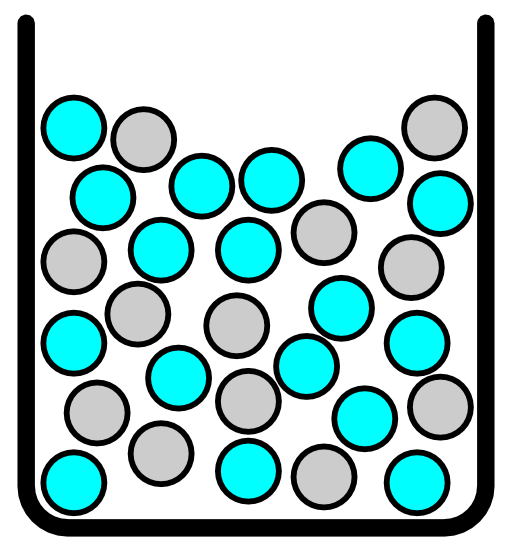

# Properties of Solutions

## Beaker Exothermic
[More Detail](beaker-exothermic/Readme.md) | [LaTeX Source](beaker-exothermic/beaker-exothermic.tex)

## Beaker Endothermic
[More Detail](beaker-endothermic/Readme.md) | [LaTeX Source](beaker-endothermic/beaker-endothermic.tex)

## Exothermic Enthalpy Diagram
[More Detail](exothermic-enthalpy-diagram/Readme.md) | [LaTeX Source](exothermic-enthalpy-diagram/sol-energetics-exothermic.tex)

## Endothermic Enthalpy Diagram
[More Detail](endothermic-enthalpy-diagram/Readme.md) | [LaTeX Source](endothermic-enthalpy-diagram/sol-energetics-endothermic.tex)

## Solid Separated in Beaker
[More Detail](solid-separated-in-beaker/Readme.md) | [Adobe Illustrator Source](solid-separated-in-beaker/solid-separated-in-beaker.ai)

## Solution in Beaker
[More Detail](solution-in-beaker/Readme.md) | [Adobe Illustrator Source](solution-in-beaker/solution-in-beaker.ai)

# License

[![Creative Commons License][image-1]][1]  
Except where otherwise noted, "Images for Introductory Chemistry" by Dale J. Brugh is licensed under a [Creative Commons Attribution-ShareAlike 4.0 International License][1]. 

If you use any portion of this work, please attribute the author (as required by the license) and provide a link to [https://github.com/djbrugh/introchem-images](https://github.com/djbrugh/introchem-images). 

[1]:    http://creativecommons.org/licenses/by-sa/4.0/

[image-1]:  https://i.creativecommons.org/l/by-sa/4.0/88x31.png