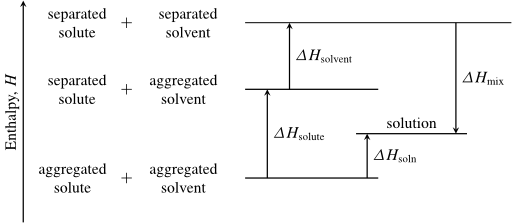

# Enthalpy Diagram for Endothermic Solution Formation

[LaTeX Source](sol-energetics-endothermic.tex)

Enthalpy diagram showing the enthalpy changes associated with endothermic solution formation.

# License

[![Creative Commons License][image-1]][1]  
Except where otherwise noted, "Images for Introductory Chemistry" by Dale J. Brugh is licensed under a [Creative Commons Attribution-ShareAlike 4.0 International License][1]. 

If you use any portion of this work, please attribute the author (as required by the license) and provide a link to [https://github.com/djbrugh/introchem-images](https://github.com/djbrugh/introchem-images). 

[1]:    http://creativecommons.org/licenses/by-sa/4.0/

[image-1]:  https://i.creativecommons.org/l/by-sa/4.0/88x31.png